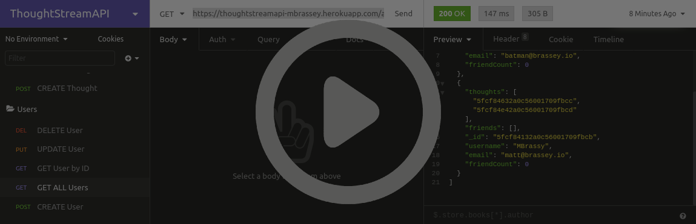
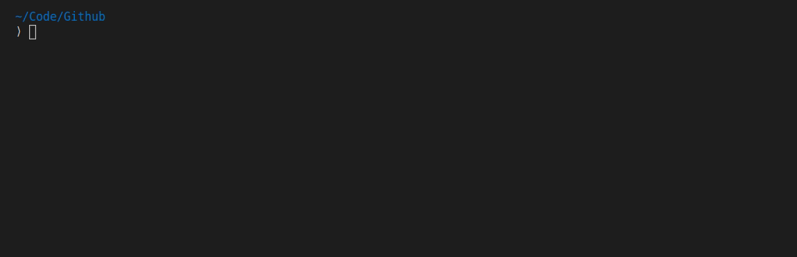
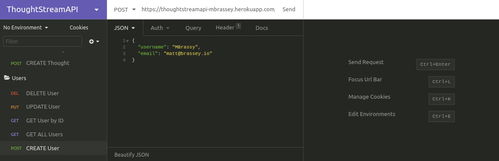
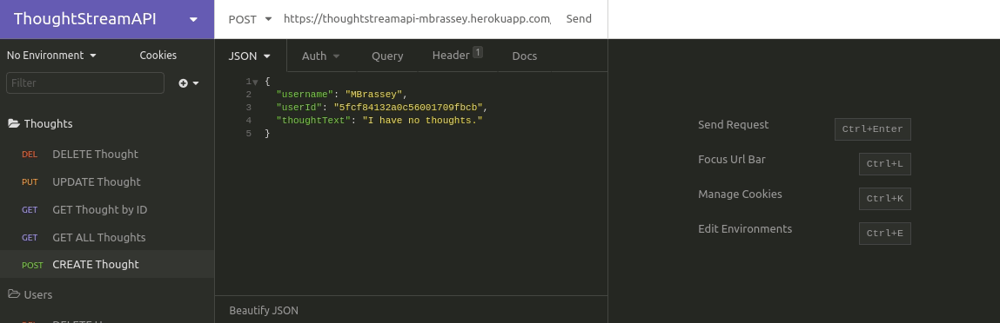
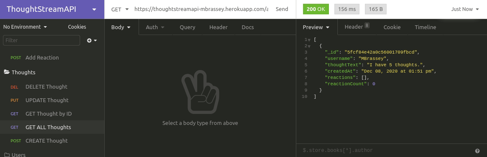

## ThoughtStreamAPI

API for a social network web application where users can share their thoughts, react to friends’ thoughts, and create a friend list. This Node.js app integrates MongoDB, Mongoose ODM, and a robust Express.js API. The backend application is deployed live @Heroku utilizing MongoDB Atlas.

#### Issues

- [x] [Initialize Application & Add User-Model](https://github.com/MBrassey/ThoughtStreamAPI/issues/1)
- [x] [Handle Thoughts](https://github.com/MBrassey/ThoughtStreamAPI/issues/2)
- [x] [Handle Reactions](https://github.com/MBrassey/ThoughtStreamAPI/issues/3)
- [x] [Friends List](https://github.com/MBrassey/ThoughtStreamAPI/issues/4)
- [x] [Generate Readme & Walkthrough Media](https://github.com/MBrassey/ThoughtStreamAPI/issues/5)

#### Requirements

    MongoDB Community Server
    node
    npm

#### Installation

    install MongoDB
    npm i

#### Usage

    npm run start
    use insomnia to test routes

<h6>
:cyclone: Click the image(s) below to view the live <a id="Screenshots" href="https://thoughtstreamapi-mbrassey.herokuapp.com/api/users/">webapplication</a>
</h6>

> Video Demonstration
> 

> Setup
> 

> User Routes
> 

> Thought Routes
> 

> Reaction Routes
> 

> Friend Routes
> 

#### Questions

Contact me at [matt@brassey.io](mailto:matt@brassey.io) with any questions or comments.

#### License

`ThoughtStreamAPI` is published under the **CC0_1.0_Universal** license.

> The Creative Commons CC0 Public Domain Dedication waives copyright interest in a work you've created and dedicates it to the world-wide public domain. Use CC0 to opt out of copyright entirely and ensure your work has the widest reach. As with the Unlicense and typical software licenses, CC0 disclaims warranties. CC0 is very similar to the Unlicense.
